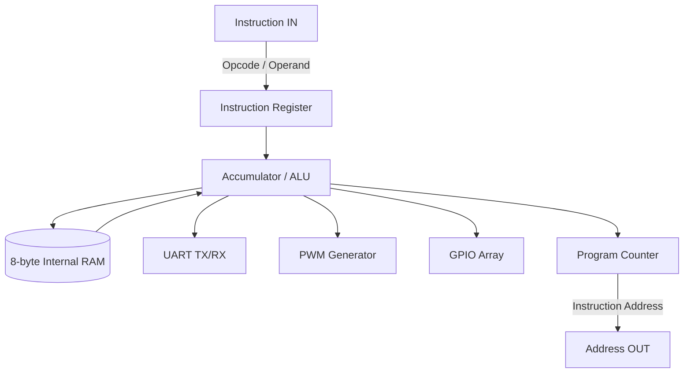

# TinySoC : 8-bit Microcontroller

  
  
  
  
  

An ultra-compact 8-bit Harvard Architecture microcontroller designed specifically for the Tiny Tapeout platform. Built for extreme efficiency, it packs a Turing-complete CPU, SRAM, fully dynamic UART, PWM, and GPIO into a single 1x1 Sky130 tile.

 

  <h3>Core Specifications</h3>

<table align="center">
  <tr>
    <th align="left">Component</th>
    <th align="left">Details</th>
  </tr>
  <tr>
    <td><strong>Data Bus</strong></td>
    <td>8-bit internal data bus</td>
  </tr>
  <tr>
    <td><strong>Instruction Bus</strong></td>
    <td>8-bit direct external fetch</td>
  </tr>
  <tr>
    <td><strong>Internal RAM</strong></td>
    <td>8 Bytes (Addresses <code>0x00</code> to <code>0x07</code>)</td>
  </tr>
  <tr>
    <td><strong>Peripherals</strong></td>
    <td>Dynamic UART, 8-bit PWM, 5x GPIO, 8-bit Timer</td>
  </tr>
  <tr>
    <td><strong>Clock Adaptability</strong></td>
    <td>16-bit software-configurable baud rate handles any system clock frequency</td>
  </tr>
</table>

 

## Architecture Overview

TinySoC operates on a highly deterministic 3-stage pipeline (FETCH -> FETCH_OP -> EXEC). Instructions are fetched externally in zero-cycles directly from the `ui_in` bus using the Program Counter supplied on the `uo_out` bus.

 

## Memory Map

The microcontroller uses **Memory-Mapped I/O** to communicate with peripherals. Accessing addresses `0x20` to `0x29` directly interacts with the hardware accelerators.

| Address | Peripheral | Type | Description |
|---|---|---|---|
| `0x00 - 0x07` | **Internal RAM** | R/W | 8 bytes of internal flip-flop based scratchpad RAM |
| `0x20` | **GPIO Data** | R/W | Read gets Input, Write sets Output |
| `0x21` | **GPIO Direction** | R/W | 1 = Output, 0 = Input |
| `0x22` | **Hardware Timer** | R/W | Free-running 8-bit hardware timer (Write clears it) |
| `0x23` | **UART RX Data** | R | Reading automatically clears the RX ready flag |
| `0x24` | **UART TX Data** | W | Writing triggers transmission instantly |
| `0x25` | **UART Status** | R | Bit 0: RX Ready, Bit 1: TX Busy |
| `0x26` | **PWM Duty** | R/W | 8-bit duty cycle compare threshold |
| `0x28` | **BAUD_DIV_L** | R/W | 16-bit UART clock divider (Low Byte) |
| `0x29` | **BAUD_DIV_H** | R/W | 16-bit UART clock divider (High Byte) |

 

## Pin Configuration

As mapped in the `info.yaml`, the physical Tiny Tapeout pins are utilized as follows:

| Group | Pin | Function | Description |
|---|---|---|---|
| **Input** | `ui[7:0]` | Instruction Input | The raw 8-bit instruction opcode/operand fetched from external memory. |
| **Output** | `uo[7:0]` | Address Output | The Program Counter driving the external memory address. |
| **Bidirectional** | `uio[4:0]` | GPIO Pins | General Purpose I/O pins, direction controlled via register `0x21`. |
| **Bidirectional** | `uio[5]` | UART TX | Serial transmit line (Output). |
| **Bidirectional** | `uio[6]` | UART RX | Serial receive line (Input). |
| **Bidirectional** | `uio[7]` | PWM OUT | Pulse Width Modulation output signal. |

 

## Verification & Tapeout

This repository utilizes an aggressive, multi-faceted verification methodology powered by Cocotb.
* **ISA Verification:** Custom assembler and regression tests verifying every opcode combination and conditional branching logic.
* **Peripheral Verification:** Cycle-accurate simulations of the dynamic UART baud generation and PWM logic.
* **Test Coverage:** Achieves 100% passing test rates across 9 individual test suites (`isa`, `io`, `stress`, `uvm`, `peripheral`, `pipeline`, `func_design`, `baud`, `soc_full`).

  
<strong>Manufactured via Tiny Tapeout - Sky130 130nm Node</strong>

